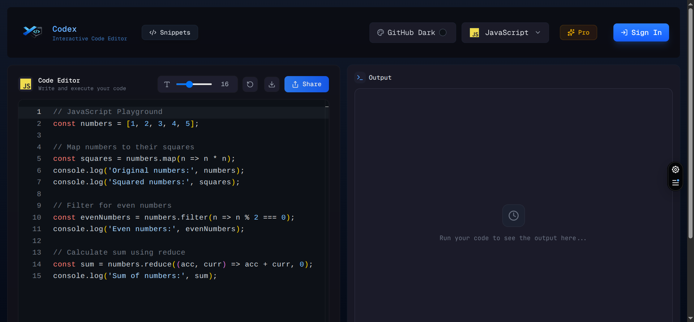
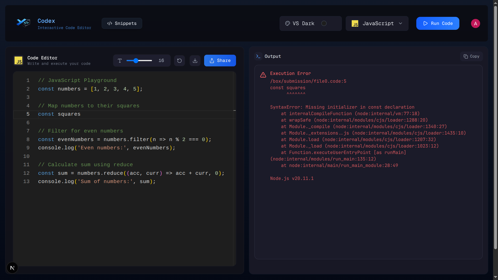

# Codex

  

  

  
  
  
  

  
  
  

## Live Demo

Explore the project live here:  
🔗 https://codex-gold-tau.vercel.app/
This link used to work as it is working now I am telling this because now when we run the piston on localhost:2000 therefor the vercel won't recognize we have the way to Deploy Piston to cloud (Run Piston on Railway/Render/Hetzner VPS) which is ($5-20/month) unfortunately due to no ecomic support I can't do that for now but you can check the screen recording of running codes on various programming language at the bottom of this file 👇🏻
---

## Description

**Codex** is an interactive web application where users can write, run, and experiment with code in the browser. It leverages a powerful combination of **React**, **Next.js**, and **TypeScript** for a smooth frontend experience, styled with **TailwindCSS**, and powered by backend logic using **Convex** and secure authentication with **Clerk**.  
To evaluate and run code snippets dynamically, it integrates the **Piston API**, enabling real code execution in a sandboxed environment.

---

## Tech Stack

### Frontend

- **React** — UI library
- **Next.js** — Full-stack React framework
- **TypeScript** — Static typing for robust code
- **TailwindCSS** — Utility-first styling

### Backend & Services

- **Convex** — Backend data & functions
- **Clerk** — Authentication & user management
- **Piston API** — Remote code execution engine

---

# In the latest code update:

  

Somehow engineer-man banned public use of Piston API on everyone and they created a whitelist that people that are added by themselves can actually use it, at first I contacted him on his Discord but got no reason with the help of KIMI AI we were able to build our own server to run the code on docker containers, I will add the commit message `piston banned solved` and if you are interested you can use it. Everything is working fine like before.

# Get Started:
npm install

--- Open three terminal ---
---
First terminal run: `npx convex dev` (for convex)
---
Second terminal run: `npm run dev` (for Next.js)
---
Third terminal run: `sudo docker ps` (I don't know if it is working on windows you should see something like 0.0.0.0:2000->2000/tcp, [::]:2000->2000/tcp   inspiring_meitner) 
---
